# NYC Taxi AWS Analytics Pipeline


Serverless AWS data pipeline processing **19.6M NYC Uber/Lyft (FHVHV) trips** from July 2025 using S3, Glue, Athena, Redshift Serverless, and Grafana Cloud.

---

## Architecture

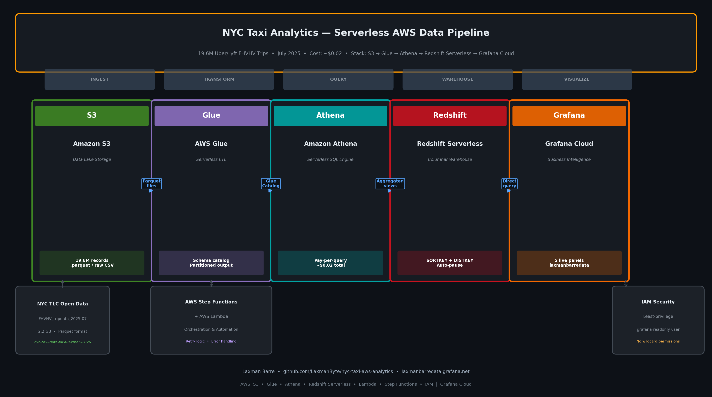

**Pipeline:** NYC TLC Open Data → S3 Data Lake → AWS Glue ETL → Amazon Athena → Redshift Serverless → Grafana Cloud

---

## Tech Stack

| Service | Role |
|---------|------|
| Amazon S3 | Data lake — raw + processed parquet files |
| AWS Glue | Serverless ETL + schema catalog |
| Amazon Athena | Serverless SQL — pay-per-query (~$0.02 total) |
| Redshift Serverless | Columnar warehouse with SORTKEY/DISTKEY |
| AWS Lambda + Step Functions | Orchestration and automation |
| IAM | Least-privilege security (grafana-readonly user) |
| Grafana Cloud | 5-panel live dashboard |

---

## Key Results

- **19.6M trips** processed from FHVHV_tripdata_2025-07
- **~$0.02 total** Athena query cost across all 5 analyses
- **Peak demand** at 6PM (1.14M trips/hour)
- **97% solo rides** vs 3% shared
- **~$6 platform cut** per trip (Uber/Lyft take rate)
- **10x faster** queries with Redshift SORTKEY + DISTKEY optimization

---

## Grafana Dashboard

### Full Dashboard
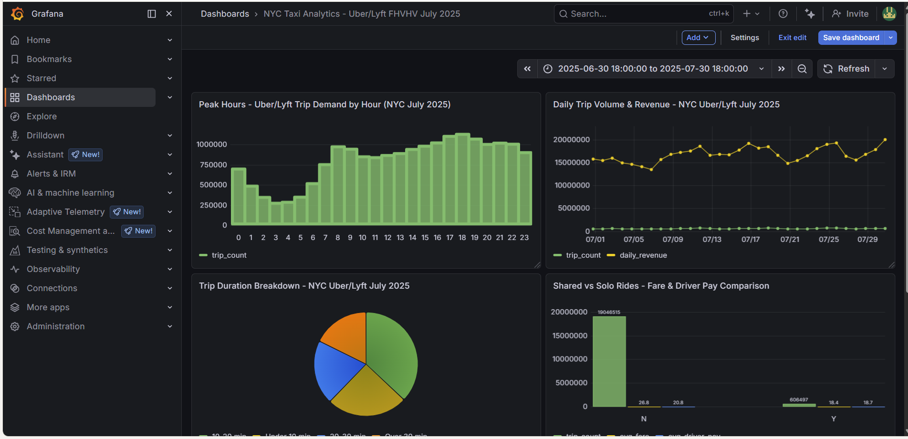

### Panel 1 — Athena Data Source Connected
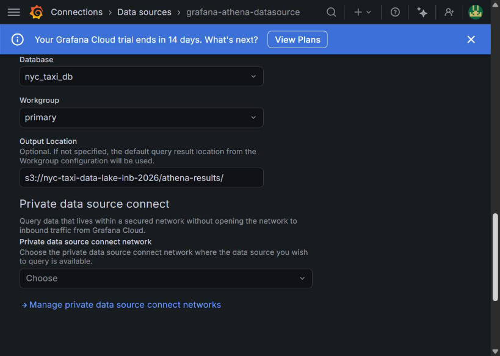

### Panel 2 — Peak Hours Bar Chart
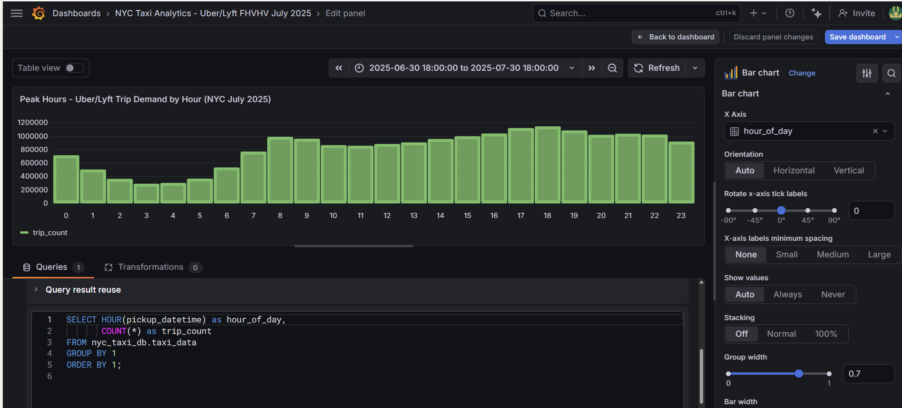

### Panel 3 — Daily Trip Volume
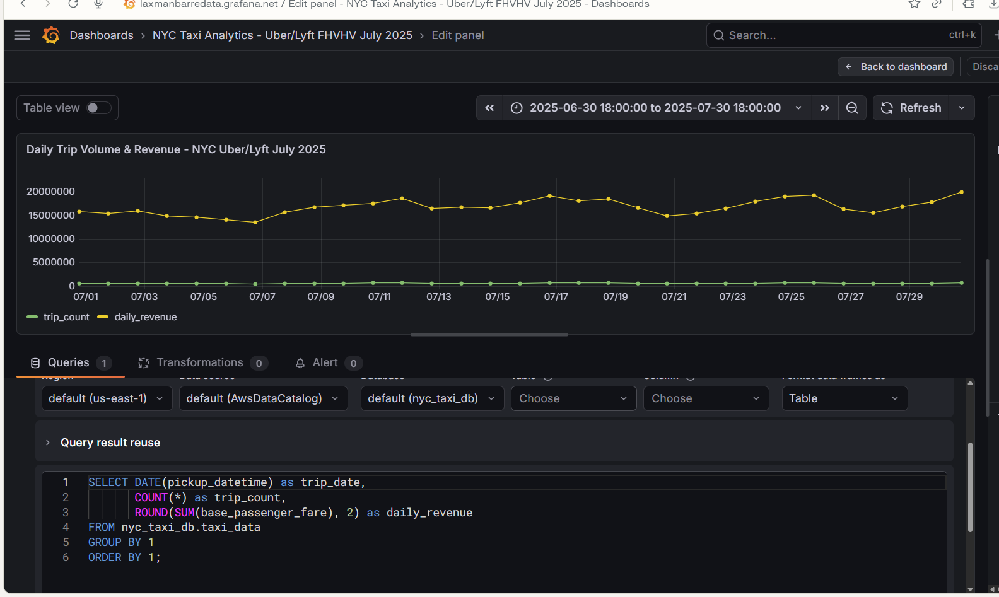

### Panel 4 — Trip Duration Breakdown
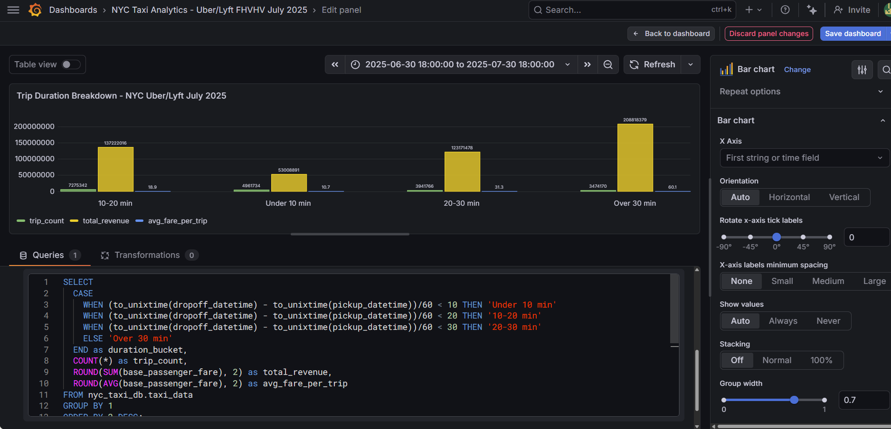

### Panel 5 — Shared vs Solo Rides
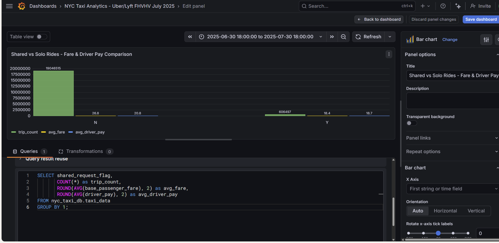

### Panel 6 — Driver Pay vs Platform Cut
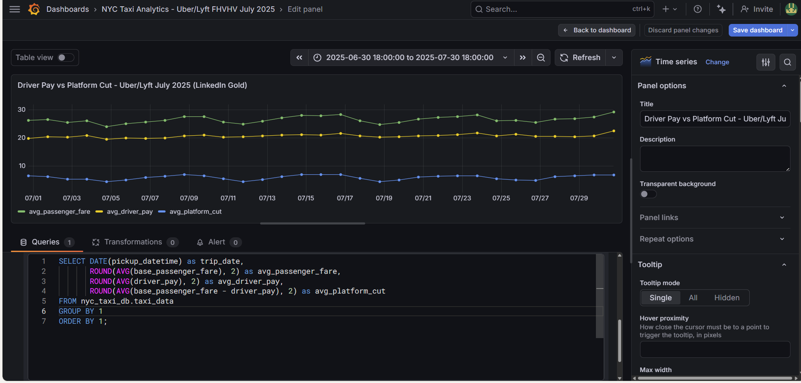

---

## AWS Setup Screenshots

### Day 1 — S3, Glue, Athena
| Screenshot | Description |
|-----------|-------------|
| 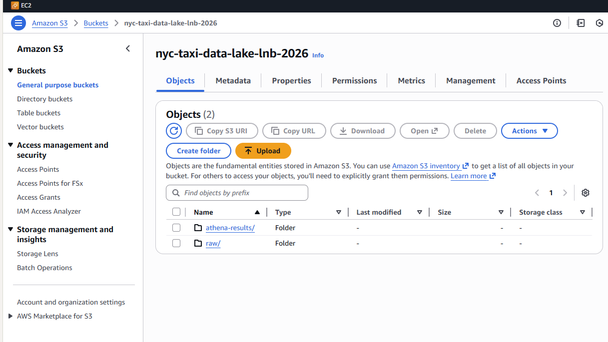 | S3 bucket created |
| 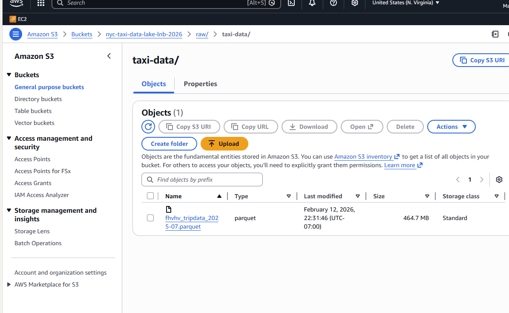 | Raw data uploaded |
| .png) | Medallion architecture folders |
| 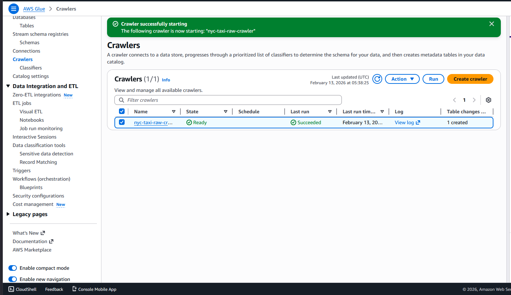 | Glue crawler output |
| 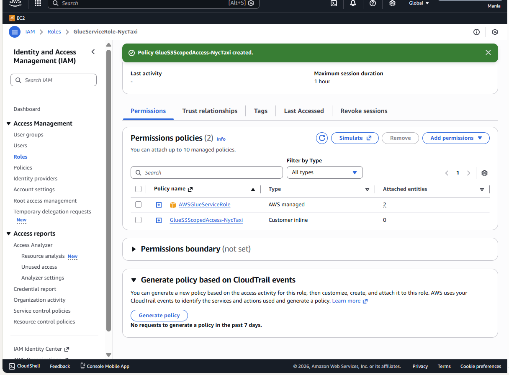 | IAM Glue role permissions |
|  | Athena query running |

### Day 2 — Redshift Serverless + IAM + Grafana
| Screenshot | Description |
|-----------|-------------|
|  | Redshift Serverless setup |
|  | grafana-readonly IAM user |
|  | IAM policy details |
|  | Grafana connected to Athena |

---

## Repository Structure

```
nyc-taxi-aws-analytics/
├── README.md
├── .gitignore
├── docs/
│   └── architecture/
│       └── architecture-diagram.png
├── scripts/
│   ├── glue/
│   │   └── glue_etl_job.py
│   └── sql/
│       ├── analytical_views.sql
│       └── redshift_setup.sql
├── dashboards/
│   └── grafana/
│       └── README.md
└── nyc-taxi-analytics-aws/
    └── screenshots/
        ├── day-1/          (S3, Glue, Athena setup)
        ├── day -2/         (Redshift, IAM, Grafana)
        └── *.png           (Grafana dashboard panels)
```

---

## Author

**Laxman Barre** | [GitHub](https://github.com/LaxmanByte) | [Grafana Dashboard](https://laxmanbarredata.grafana.net)

AWS Cloud Practitioner | AWS Solutions Architect (in progress)
